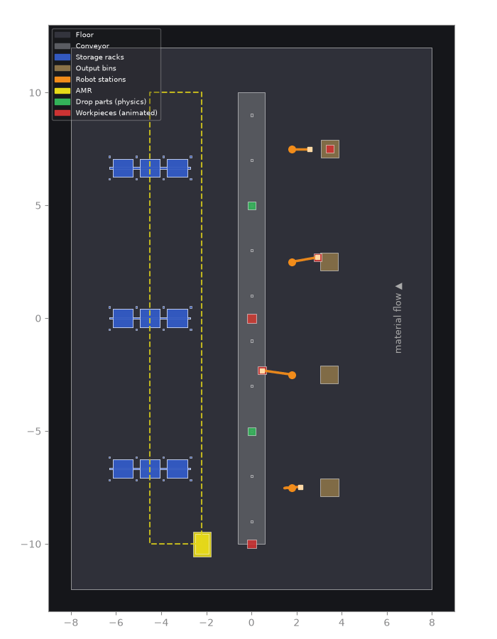
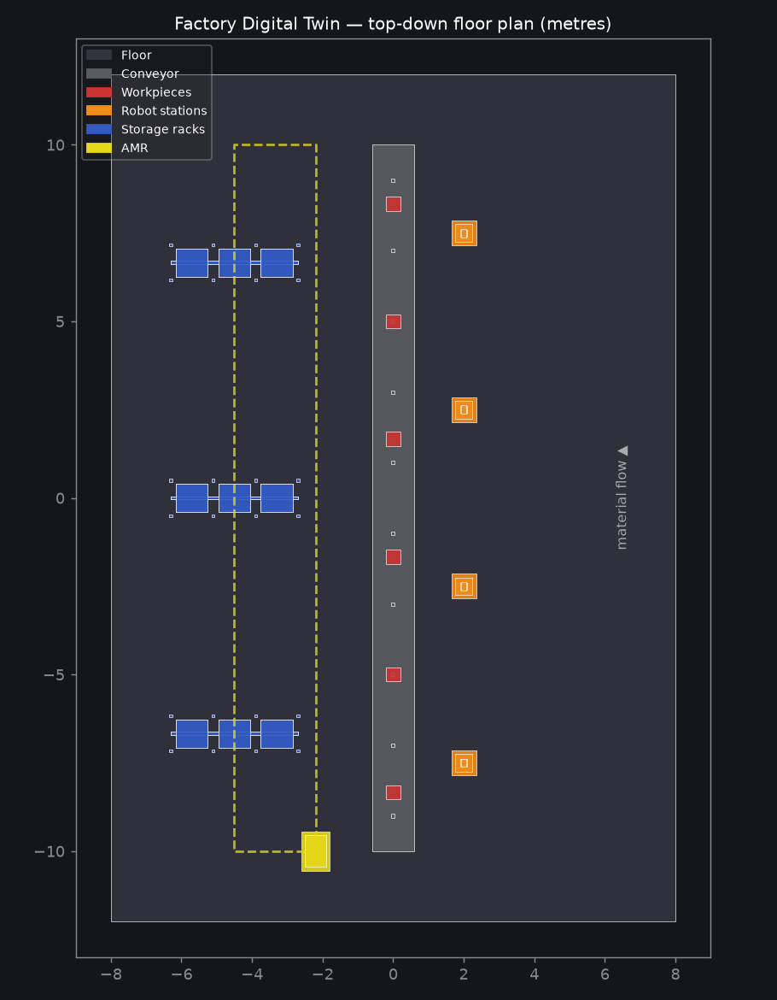

# Factory Digital Twin — OpenUSD

A procedurally-generated **factory production-line digital twin** built with
[OpenUSD](https://openusd.org) (Pixar's Universal Scene Description — the format
at the core of **NVIDIA Omniverse**).

Pure Python, no GPU required to *build*; validated in Isaac Sim on an L40S
(see [Verified in real PhysX](#verified-in-real-physx)).
It runs anywhere `usd-core` installs (incl. macOS)
and emits a `.usd` scene that opens directly in Omniverse / USD Composer /
Isaac Sim on any RTX machine, where the placeholder primitives can be swapped
for real CAD assets and lit with RTX path tracing.



*Closed-loop **pick-and-place**, rendered GPU-free straight from the USD. Each
arm (orange, drawn by forward kinematics from its time-sampled joint drives)
picks a part off the belt and sets it in an output bin, staggered across the four
stations. Red = workpieces (riding the belt, then carried to the tan bins);
green = dynamic parts that drop in Isaac Sim; blue = instanced racks; yellow =
AMR + route.*



## Why this is an Omniverse project without an Omniverse install

Omniverse's three pillars are **OpenUSD** (scene description), **RTX**
(rendering) and **PhysX** (simulation). RTX needs an NVIDIA GPU — but *every*
Omniverse workflow is authored on top of USD, and PhysX is driven entirely by
**UsdPhysics** schemas that live in the USD file. This project builds both
layers directly, which is the transferable, portable core skill:

- **Stage & scenegraph** — `/World` hierarchy, `Xform` transforms, Z-up / metres
  metadata (the Isaac Sim / robotics convention).
- **Materials** — portable `UsdPreviewSurface` PBR shaders (`UsdShade`).
- **Lighting** — `UsdLux` dome + distant key light.
- **Instancing at scale** — storage racks are authored **once** as a prototype
  and stamped as `instanceable` references, the technique that keeps
  factory/warehouse twins light.
- **Semantic geometry** — the AMR route is a first-class `BasisCurves` path, not
  a baked mesh, so a nav stack (or Isaac Sim) can consume it.
- **Physics & articulation** — the robot arms are real `UsdPhysics`
  articulations (see below), so Isaac Sim loads them as drivable robots.
- **Animation** — workpieces are kinematic bodies driven by **time-sampled**
  transforms, so the conveyor flow is authored in the file and loops seamlessly.
- **Data-driven** — the whole plant is generated from a YAML config; no code
  edits needed to change the layout.

## Physics & articulation

Each of the 4 robot arms is authored as a **UsdPhysics articulation** — a
kinematic chain of rigid bodies joined by revolute (hinge) joints — so PhysX in
Isaac Sim treats it as one drivable robot instead of loose meshes:

```
base_link ──fixed──▶ world          (bolted to the floor)
   │ joint0_yaw       revolute · axis Z · ±170°   (turntable)
link0
   │ joint1_shoulder  revolute · axis Y · ±90°
link1  (upper arm)
   │ joint2_elbow     revolute · axis Y · ±150°
link2  (forearm + gripper)
```

- Global `UsdPhysics.Scene` with Earth gravity (−Z, 9.81 m/s²); the floor is a
  static collider.
- Every link has `RigidBodyAPI` + `MassAPI`; every visual gprim has
  `CollisionAPI`.
- Every revolute joint has angle **limits** and an angular **`DriveAPI`**
  (stiffness/damping + a target angle) — the actuation Isaac Sim reads to
  position the arm.
- The shoulder and elbow drive targets are **time-sampled** into a pick-cycle
  trajectory (phased per robot), so in Isaac Sim the arms actually reach toward
  the belt and retract on the timeline — the correct way to command a robot
  (author the joint trajectory, not the link transforms).

> **Rest pose vs. driven pose:** the USD file stores the arm at rest (pointing
> straight up) and the *motion* in the joint drive targets. The arm only bends
> once a solver applies those targets. Isaac Sim does this with PhysX; for the
> GPU-free GIF, `preview.py` runs **forward kinematics** on the same joint
> angles to draw the driven pose. Both read one source of truth — the drive
> targets — so the preview matches what PhysX produces.

## Closed-loop pick-and-place

Each arm runs a full pick cycle: a part rides the belt to the station, the arm
picks it up, carries it, and sets it in an output bin on the +X side — the four
stations phased so they work in sequence.

The grasp is a **baked kinematic pick**: the picked part is a kinematic body
whose transform is time-sampled to (1) ride the belt, (2) **follow the gripper**
during the grasp window — sampled from the *same* forward kinematics the arm
uses, so the part stays exactly in the hand — and (3) rest in the bin. Because
it is kinematic, the pick plays identically in the GPU-free GIF and in Isaac Sim.

> **Why baked, not a contact grasp:** USD has no time-varying parenting, and a
> physics joint cannot be created/destroyed on the timeline from static USD —
> true contact-based grasping (attach/detach when the gripper touches the part)
> needs an Isaac Sim runtime script (a `SurfaceGripper` or a scripted joint).
> That is the natural next step; here the pick is authored and solver-independent.

Verify the rigging without a GPU:

```bash
PYTHONPATH=src python -c "from pxr import Usd,UsdPhysics as P; s=Usd.Stage.Open('output/factory_twin.usda'); \
print('articulations', sum(p.HasAPI(P.ArticulationRootAPI) for p in s.Traverse()), \
'revolute joints', sum(p.IsA(P.RevoluteJoint) for p in s.Traverse()))"
```

## Verified in real PhysX

That check reads the file. To find out what a solver actually *does* with it,
the scene was run headless in **Isaac Sim 5.1** on an **NVIDIA L40S**
(`g6e.xlarge` on [NVIDIA Brev](https://brev.nvidia.com)) — see
[`brev/`](brev/) for the harness, the full method, and the report.

| Measured under PhysX | |
|---|---|
| Articulation roots parsed | **4 / 4**, 3 DOF each |
| Drive targets outside a joint limit | **0** |
| Shoulder travel on the timeline | **141.0°** (authored range 145.6°) |
| Elbow travel on the timeline | **85.2°** |
| Steady-state tracking lag | **4.8–5.4°** |
| Arms holding their authored rest pose | **0.409°** worst |
| Drop parts at rest | **z = 1.05 m**, exactly belt top + half extent |

So the claim above — that the arms reach toward the belt and retract on the
timeline in Isaac Sim — is measured, not assumed.

It did not pass the first time. The solver found a real bug that authoring
alone cannot surface: the **kinematic** workpieces were shoving the arms off
their commanded pose by up to **20.6°** and bulldozing the drop parts 30–56 m
down the line, because a baked grasp authors the carried part *inside* the
gripper and PhysX treats a kinematic body as infinitely massive. An ablation
pass named the cause, and filtering those parts into their own
`UsdPhysics.CollisionGroup` fixed it. The write-up in [`brev/`](brev/) has the
numbers, the two wrong hypotheses that came first, and what refuted them.

## Scene contents

| Asset | Count | Notes |
|-------|-------|-------|
| Conveyor belt | 1 | 20 m, runs along +Y (material-flow direction), collider bed |
| Pass-through parts | 2 | **kinematic** parts, time-sampled flow along the belt |
| Pick parts + bins | 4 + 4 | **picked** off the belt by an arm and placed in an output bin |
| Drop parts | 3 | **dynamic** rigid bodies that fall onto the belt in Isaac Sim |
| Robot-arm workstations | 4 | 3-DOF **UsdPhysics articulations**, along the +X side |
| Storage racks | 3 | `instanceable` — 3 bays × 3 levels each |
| AMR + route | 1 | mobile robot with a dashed loop path |
| Lights | 2 | dome + distant key |

All counts, positions, speeds and robot poses come from
[`config/factory.yaml`](config/factory.yaml) — edit it and re-run to generate a
different plant.

## Quick start

```bash
python3 -m venv .venv
source .venv/bin/activate
pip install -e .

# generate the USD scene from the YAML config
factory-twin-build --config config/factory.yaml --out output/factory_twin.usda

# GPU-free previews
factory-twin-preview --in output/factory_twin.usda --out output/floorplan.png   # static PNG
factory-twin-animate --in output/factory_twin.usda --out output/conveyor.gif     # animated GIF
```

Change the plant by editing `config/factory.yaml` (line length, part count and
speed, robot count/poses, rack grid, animation fps …) and re-running the build.

## Open it in Omniverse (on an RTX machine)

1. Copy `output/factory_twin.usda` (or `.usdc`) to a Windows/Linux box with an
   NVIDIA RTX GPU.
2. Open it in **USD Composer** / **Omniverse Kit** / **Isaac Sim** — the scene
   loads with materials and lights already bound.
3. Swap placeholder cubes/cylinders for real assets, enable RTX path tracing,
   and (next step) add `UsdPhysics` joints to articulate the robot arms.

## Project layout

```
src/factory_twin/
  assets.py        # reusable USD asset builders (materials, boxes, robot, rack, AMR)
  physics.py       # UsdPhysics rigging: scene, articulated arms, kinematic/dynamic bodies
  kinematics.py    # forward kinematics for the arm (drives the GPU-free preview)
  build_scene.py   # config-driven assembly of the full production line -> .usda
  preview.py       # GPU-free renderers: floor-plan PNG + conveyor-flow GIF
config/factory.yaml  # the layout config that drives build_scene
output/            # generated .usda / .usdc (git-ignored) + sample PNG/GIF (tracked)
```

## Roadmap

- [x] `UsdPhysics` rigid bodies + revolute joints so the arms articulate in Isaac Sim
- [x] Animate workpieces travelling down the belt (time-sampled transforms)
- [x] Parameterise the whole layout from a YAML config
- [x] Conveyor + workpieces as physics bodies (kinematic parts ride, dynamic parts drop)
- [x] Drive the robot joints on a timeline (time-sampled drive targets + FK preview)
- [x] Closed-loop pick-and-place: arms pick parts off the belt into output bins
- [ ] A proper 3D isometric preview (currently top-down only)
- [ ] Contact-based grasp in Isaac Sim (SurfaceGripper / scripted attach-detach)

## Requirements

- Python ≥ 3.10
- [`usd-core`](https://pypi.org/project/usd-core/) — OpenUSD Python runtime
- `pyyaml` — reads the layout config
- `matplotlib` + `pillow` — for the GPU-free PNG / GIF previews only

## License

MIT
